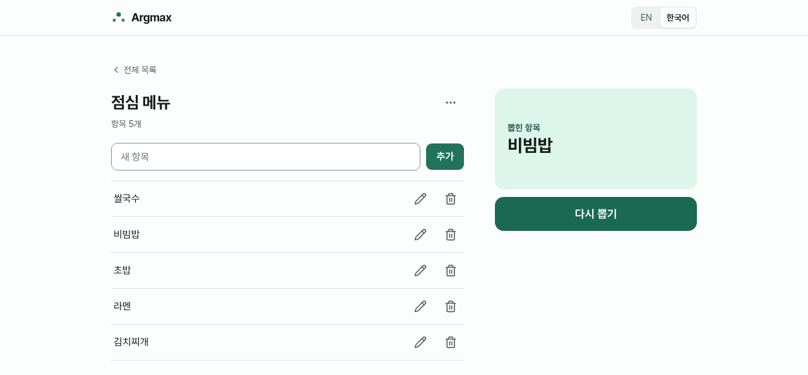

# Argmax

[English](README.md) | 한국어

[](https://github.com/dev1f965x/argmax/actions/workflows/ci.yml)
[](LICENSE)

Argmax는 목록을 만들고 항목을 추가하면 그중 하나를 무작위로 뽑는 웹 앱입니다.

**사용하기:** <https://argmax.dev1f965x.workers.dev>



## 기능

- 목록 하나에 항목 최대 1,000개, 항목마다 최대 100자, 목록은 최대 100개까지 만들 수 있습니다.
- 짧은 애니메이션과 함께 항목 하나를 무작위로 뽑고, 원하는 만큼 다시 뽑을 수 있습니다.
- 항목 추가, 수정, 삭제(삭제 후 되돌리기 가능), 목록 이름 바꾸기와 삭제를 지원합니다.
- 목록은 계정 없이 이 브라우저에만 저장되며, 열려 있는 탭끼리 같은 상태로 유지됩니다.
- 목록을 링크로 공유할 수 있습니다. 링크는 서버 없이 기기에서 만들어지며 목록 자체를 담고, 받은 사람은 먼저 확인한 뒤 사본을 추가할 수 있습니다.
- 영어와 한국어를 지원하며, 브라우저 언어를 따르고 상단에서 바꿀 수 있습니다.
- 키보드와 화면 낭독기로 쓸 수 있으며, WCAG 2.2 AA 기준의 axe 자동 검사와 NVDA 확인을 거쳤습니다. 폭 360px 휴대폰부터 데스크톱까지 동작합니다.

변경 사항은 [변경 이력](CHANGELOG.md)에 있습니다.

## 개발

저장소를 Dev Container로 엽니다. Node.js와 pnpm은 컨테이너에 설치되어 있습니다.

```sh
pnpm install
pnpm dev
```

| 스크립트 | 용도 |
| --- | --- |
| `pnpm dev` | 개발 서버 실행(http://127.0.0.1:5173) |
| `pnpm build` | 타입 검사 후 `dist/`에 빌드하고 `dist/third-party-notices.txt` 생성 |
| `pnpm preview` | 운영 보안 헤더를 붙여 운영 빌드 미리보기 |
| `pnpm check` | 포맷 검사와 린트(Biome), 디자인 토큰·문구 검사, 의존성 라이선스 검사, knip |
| `pnpm lint` | 린트만 실행 |
| `pnpm format` | 파일 포맷 |
| `pnpm typecheck` | 타입 검사 |
| `pnpm test` | 단위·컴포넌트 테스트 실행(Vitest) |
| `pnpm test:watch` | 단위·컴포넌트 테스트를 감시 모드로 실행 |
| `pnpm test:e2e` | 빌드 후 Chromium·Firefox·WebKit에서 E2E·접근성·보안 헤더 테스트 실행(Playwright, axe-core) |
| `pnpm check:licenses` | 의존성 라이선스 검사만 실행 |
| `pnpm check:content` | UI 문구 금지 패턴 검사만 실행 |
| `pnpm knip` | 쓰지 않는 파일, export, 의존성 찾기 |

## 배포

앱은 Cloudflare Workers에 정적 파일로 배포되며, 설정은 `wrangler.jsonc`에 있습니다. Cloudflare Workers Builds가 이 저장소에 연결되어 있으면, `main`에 머지할 때 <https://argmax.dev1f965x.workers.dev>에 운영 배포됩니다.

다른 브랜치는 Worker Preview로 배포되며, 그 URL이 풀 리퀘스트에 달립니다. 미리보기는 `wrangler.jsonc`의 `previews` 블록으로 켜며, Wrangler에서는 `wrangler preview`가 오픈 베타 명령입니다. 미리보기 URL은 공개됩니다. 미리보기에서는 첫 화면에서 앱 안으로 이동해야 하며, `/lists/...` 같은 앱 경로로 바로 접속하면 운영과 달리 404가 납니다.

Workers Builds 설정:

| 항목 | 값 |
| --- | --- |
| 빌드 명령 | `pnpm build` |
| 배포 명령 | `npx wrangler deploy` |
| 운영 외 브랜치 배포 명령 | `npx wrangler preview` |
| 빌드 변수 | `PNPM_VERSION=12.8.1` (빌드 이미지의 기본 pnpm이 더 오래된 버전이므로 `packageManager`와 같게 유지) |

Node.js 버전은 `.node-version`을 따릅니다. 운영 배포는 GitHub CI를 기다리지 않으며, `main` 규칙셋이 머지 전에 CI 통과를 강제합니다.

롤백은 Cloudflare 대시보드에서 Worker의 **Deployments**를 열고 이전 버전으로 되돌리거나, `pnpm exec wrangler login` 후 `pnpm exec wrangler rollback`을 실행합니다. 롤백한 뒤에도 다음 `main` 머지가 배포되면 롤백 상태는 덮어쓰입니다.

## 개인정보

Argmax에는 계정과 쿠키가 없으며, 개인정보를 요청하거나 저장하지 않습니다. 목록과 선택한 언어는 브라우저의 로컬 저장소에만 저장되며 어디로도 전송되지 않습니다. 공유 링크는 기기에서 만들어지며 목록을 `#` 뒷부분에 담습니다. 브라우저는 이 부분을 서버로 보내지 않으므로 목록은 Argmax로 전송되지 않지만 링크는 대화방이나 방문 기록처럼 저장된 곳에 남으며, Argmax는 다른 사람이 가진 링크에서 목록을 지울 수 없습니다. 호스팅 업체인 Cloudflare는 사이트를 제공하고 보호하기 위해 IP 주소 같은 기술적인 요청 정보를 처리합니다.

운영 사이트는 사용 현황을 측정하기 위해 이름이나 계정 정보가 없는 사용 데이터를 [Umami Cloud](https://umami.is)(미국, 6개월 보관)로 보냅니다. 보내는 것은 화면 조회, 목록 생성, 뽑기, 공유(공유 메뉴 또는 복사)와 공유받은 목록 추가, 첫 방문 여부(브라우저에 저장된 목록의 생성 시각으로 판단), 브라우저 언어, 화면 크기, 링크한 사이트의 주소(경로 제외)입니다. Umami의 오픈소스 데이터 모델([스키마](https://github.com/umami-software/umami/blob/master/prisma/schema.prisma), 2026-10-04 확인)에 따르면 IP 주소는 저장하지 않고, IP 주소로 추정한 대략적인 위치(국가, 지역, 도시)와 User-Agent에서 알아낸 브라우저, 운영체제, 기기 종류를 기록합니다. 목록 이름, 항목, 목록 id는 보내지 않으며, 개발 환경, 테스트, 미리보기에서나 브라우저가 Global Privacy Control 또는 Do Not Track 신호를 보낼 때는 아무것도 보내지 않습니다. 앱은 Umami의 스크립트 없이 이벤트 API를 직접 호출합니다. 자세한 내용은 앱의 개인정보 페이지에 있습니다. 공개하기 어려운 개인정보 문의는 argmax.contact@proton.me로 보내 주세요.

## 서비스와 약관

약관은 2026-10-04에 확인했습니다. Argmax는 비상업 프로젝트이며, 상업적으로 쓰기 전에는 "확인 안 됨"으로 표시한 약관을 다시 확인해야 합니다.

| 서비스 | 용도 | 플랜과 한도 | 상업적 이용 | 약관 |
| --- | --- | --- | --- | --- |
| Cloudflare Workers | 호스팅과 미리보기 배포 | 무료: 정적 파일 요청은 무료·무제한, 다른 한도는 과금 대신 차단, 결제 수단 없음 | 확인 안 됨 | [약관](https://www.cloudflare.com/terms/), [요금](https://developers.cloudflare.com/workers/platform/pricing/) |
| Umami Cloud | 사용 현황 분석 | Hobby, 0달러: 월 10만 이벤트, 사이트 1개, 6개월 보관, 이벤트당 추가 요금은 유료 플랜에만 적용, 결제 수단 없음 | 확인 안 됨 | [약관](https://umami.is/terms), [개인정보](https://umami.is/privacy) |
| GitHub | 저장소, Actions, CodeQL, 비밀 정보 검사, Dependabot 알림 | 공개 저장소 무료 | 가능 | [약관](https://docs.github.com/en/site-policy/github-terms/github-terms-of-service) |
| Mend Renovate(GitHub App) | 의존성 업데이트 풀 리퀘스트 | 무료 | 가능 | [약관](https://www.mend.io/terms-of-service/), [개인정보](https://www.mend.io/privacy-policy/) |
| Shields.io | 이 README의 라이선스 배지(CI 배지는 GitHub가 제공) | 무료 | 확인 안 됨(약관 미게시) | [Shields.io](https://shields.io/) |
| Dev Container 이미지와 Claude Code 기능 | 개발 환경 | `mcr.microsoft.com/devcontainers/typescript-node`, `ghcr.io/anthropics/devcontainer-features/claude-code`, 모두 MIT | 가능 | [이미지 라이선스](https://github.com/devcontainers/images/blob/main/LICENSE), [기능 저장소](https://github.com/anthropics/devcontainer-features) |

## 문의와 보안

문의, 버그 제보, 요청은 유형별 양식이 있는 [GitHub 이슈](https://github.com/dev1f965x/argmax/issues/new/choose)로 남겨 주세요. 앱 하단의 "의견 보내기"도 이곳으로 연결됩니다. 보안 문제는 [SECURITY.md](SECURITY.md)에 안내된 방법으로 비공개 제보해 주세요.

## 라이선스

[MIT](LICENSE). 서드파티 라이선스는 빌드할 때마다 생성되는 `third-party-notices.txt`에 있으며, 앱 하단에서 볼 수 있습니다.
