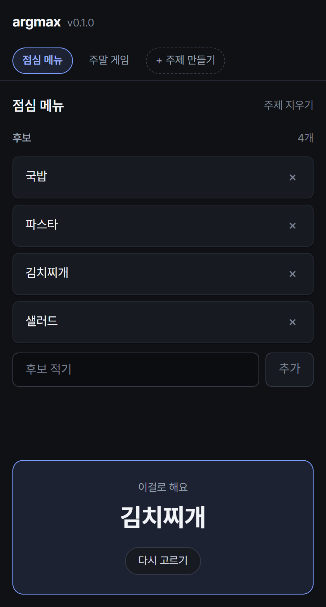

<a id="readme-top"></a>

[![Contributors][contributors-shield]][contributors-url]
[![Forks][forks-shield]][forks-url]
[![Stargazers][stars-shield]][stars-url]
[![Issues][issues-shield]][issues-url]
[![MIT License][license-shield]][license-url]

<br />
<div align="center">
  <a href="https://github.com/dev1f965x/argmax">
    
  </a>

  <h3 align="center">argmax</h3>

  <p align="center">
    Make a topic, fill it with options, and let it choose.
    <br />
    <a href="https://dev1f965x.github.io/argmax/">Open it »</a>
    ·
    <a href="docs/product.md">Explore the docs</a>
    ·
    <a href="https://github.com/dev1f965x/argmax/releases">Download</a>
    ·
    <a href="https://github.com/dev1f965x/argmax/issues/new?labels=bug">Report Bug</a>
    ·
    <a href="https://github.com/dev1f965x/argmax/issues/new?labels=feature">Request Feature</a>
  </p>
</div>

<details>
  <summary>Table of Contents</summary>
  <ol>
    <li>
      <a href="#about-the-project">About The Project</a>
      <ul>
        <li><a href="#built-with">Built With</a></li>
      </ul>
    </li>
    <li>
      <a href="#getting-started">Getting Started</a>
      <ul>
        <li><a href="#prerequisites">Prerequisites</a></li>
        <li><a href="#installation">Installation</a></li>
      </ul>
    </li>
    <li><a href="#usage">Usage</a></li>
    <li><a href="#roadmap">Roadmap</a></li>
    <li><a href="#license">License</a></li>
    <li><a href="#contact">Contact</a></li>
    <li><a href="#acknowledgments">Acknowledgments</a></li>
  </ol>
</details>

## About The Project

<div align="center">
  
</div>

"점심 뭐 먹지." The list is short, the stakes are low, and the deciding still eats ten
minutes and someone's patience.

argmax holds the list and takes the last step.

- A **topic** is one recurring question — 점심 메뉴, 주말 게임 — and holds the options for it.
- Options go in a line at a time, and out with one tap. A topic is renamed by clicking its
  title; deleting one can be undone, options and all.
- One button picks one option and says it large. The draw is uniform: every option has
  exactly the same chance every time, with the biased tail of the random source thrown
  away rather than folded in.
- Everything stays on the device. No account, no sync, no analytics, and no network calls
  at all beyond the desktop build checking for its own update.

The same app runs as a page, as a Windows window, and as an Android app, from one code
base.

<p align="right">(<a href="#readme-top">back to top</a>)</p>

### Built With

[](https://tauri.app/)
[](https://react.dev/)
[](https://www.typescriptlang.org/)
[](https://vite.dev/)
[](https://www.rust-lang.org/)
[](https://playwright.dev/)
[](https://vitest.dev/)
[](https://biomejs.dev/)
[](https://docs.github.com/actions)

<p align="right">(<a href="#readme-top">back to top</a>)</p>

## Getting Started

### Prerequisites

Nothing, to use it in a browser. To build it: [Node.js](https://nodejs.org) 24,
[Rust](https://rustup.rs) stable, and the
[Tauri prerequisites](https://tauri.app/start/prerequisites/) — plus the Android SDK and
NDK for the APK.

### Installation

- **Web** — <https://dev1f965x.github.io/argmax/>. Nothing to install, and it keeps working
  offline once loaded.
- **Windows** — the `*-setup.exe` from the
  [latest release](https://github.com/dev1f965x/argmax/releases/latest). It is unsigned, so
  SmartScreen warns once: **More info** → **Run anyway**. It updates itself from then on.
- **Android** — the `.apk` from the same release. Android asks once for permission to
  install an app from outside the Play Store.

From source:

```sh
git clone https://github.com/dev1f965x/argmax.git
cd argmax
npm install
npm run dev                # the page
npm run tauri dev          # the window
npm run tauri android dev  # the app, on a phone or an emulator
```

<p align="right">(<a href="#readme-top">back to top</a>)</p>

## Usage

1. **주제 만들기**, and name the thing you keep arguing about.
2. Write the options, one line at a time. A duplicate is refused before it goes in.
3. **고르기**. One of them comes back; **다시 고르기** draws again.

Click a topic's title to rename it in place. **주제 지우기** asks first when the topic holds
options, and the **되돌리기** that follows brings it back whole.

Topics live in the browser or the app that made them, and do not follow you between
devices — that would need an account, which this app does not have.

The interface is in Korean.

<p align="right">(<a href="#readme-top">back to top</a>)</p>

## Roadmap

- [x] 1.0.0 — topics, options, a uniform pick, on the web, Windows, and Android
- [ ] 1.1.0 — a history of what was picked, and an option to avoid repeating the last one
- [ ] later — weights, if using it proves they are wanted

See the [open issues](https://github.com/dev1f965x/argmax/issues) for the full list.

<p align="right">(<a href="#readme-top">back to top</a>)</p>

## License

Distributed under the MIT License. See [`LICENSE`](LICENSE).

<p align="right">(<a href="#readme-top">back to top</a>)</p>

## Contact

[@dev1f965x](https://github.com/dev1f965x) — https://github.com/dev1f965x/argmax

<p align="right">(<a href="#readme-top">back to top</a>)</p>

## Acknowledgments

- [Pretendard](https://github.com/orioncactus/pretendard) — SIL Open Font License 1.1, see [`licenses/`](licenses)
- [Shields.io](https://shields.io)
- [Best-README-Template](https://github.com/othneildrew/Best-README-Template)

<p align="right">(<a href="#readme-top">back to top</a>)</p>

[contributors-shield]: https://img.shields.io/github/contributors/dev1f965x/argmax.svg?style=for-the-badge
[contributors-url]: https://github.com/dev1f965x/argmax/graphs/contributors
[forks-shield]: https://img.shields.io/github/forks/dev1f965x/argmax.svg?style=for-the-badge
[forks-url]: https://github.com/dev1f965x/argmax/network/members
[stars-shield]: https://img.shields.io/github/stars/dev1f965x/argmax.svg?style=for-the-badge
[stars-url]: https://github.com/dev1f965x/argmax/stargazers
[issues-shield]: https://img.shields.io/github/issues/dev1f965x/argmax.svg?style=for-the-badge
[issues-url]: https://github.com/dev1f965x/argmax/issues
[license-shield]: https://img.shields.io/github/license/dev1f965x/argmax.svg?style=for-the-badge
[license-url]: https://github.com/dev1f965x/argmax/blob/main/LICENSE
