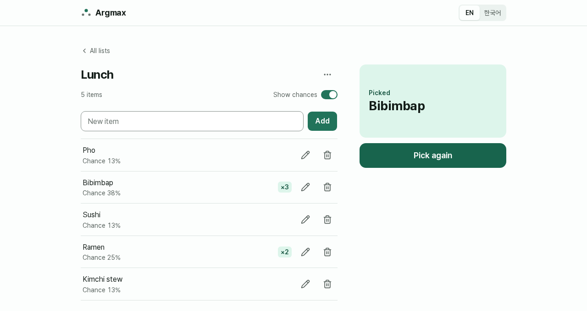

# Argmax

English | [한국어](README.ko.md)

[](https://github.com/dev1f965x/argmax/actions/workflows/ci.yml)
[](LICENSE)

Argmax is a web app for making picks: create a list, add items, and pick one at random.

**Use it:** <https://argmax.dev1f965x.workers.dev>



## Features

- Lists of up to 1,000 items, each up to 100 characters; up to 100 lists.
- Pick one item at random, with a short animation, and pick again as often as you like.
- Give an item a higher weight to make it more likely to be picked, and turn on "Show chances" to see each item's chance.
- Add, edit, and remove items, with Undo after a removal; rename and delete lists.
- Lists stay in this browser only, with no account, and stay in step across open tabs.
- Share a list as a link. The link is built on the device and carries the list in the part after `#`, so no server stores it; the recipient sees the list first and can add a copy.
- English and Korean, following the browser's language, with a switch in the header.
- Works with a keyboard and screen readers, checked with automated axe scans against WCAG 2.2 AA and an NVDA pass; on phones from 360 px wide to desktops.

Changes are listed in the [changelog](CHANGELOG.md).

## Development

Open the repository in its Dev Container. Node.js and pnpm are installed there.

```sh
pnpm install
pnpm dev
```

| Script | Purpose |
| --- | --- |
| `pnpm dev` | Start the dev server at http://127.0.0.1:5173 |
| `pnpm build` | Type check, build to `dist/`, and write `dist/third-party-notices.txt` |
| `pnpm preview` | Serve the production build with the production security headers |
| `pnpm check` | Format check and lint (Biome), the design token and content checks, the dependency license check, and knip |
| `pnpm lint` | Lint only |
| `pnpm format` | Format files |
| `pnpm typecheck` | Type check |
| `pnpm test` | Run unit and component tests (Vitest) |
| `pnpm test:watch` | Run unit and component tests in watch mode |
| `pnpm test:e2e` | Build and run end-to-end, accessibility, and security header tests in Chromium, Firefox, and WebKit (Playwright, axe-core) |
| `pnpm check:licenses` | Dependency license check only |
| `pnpm check:content` | Banned-pattern check for UI text only |
| `pnpm knip` | Find unused files, exports, and dependencies |

## Deployment

The app is deployed to Cloudflare Workers as static assets, configured in `wrangler.jsonc`. When Cloudflare Workers Builds is connected to this repository, a merge to `main` deploys to production at <https://argmax.dev1f965x.workers.dev>.

Other branches get a Worker Preview, whose URL is posted on the pull request. The `previews` block in `wrangler.jsonc` turns previews on; Wrangler labels `wrangler preview` an open beta command. Preview URLs are public. In a preview, open the root URL and navigate in the app: direct links to app routes such as `/lists/...` return 404 there, unlike in production.

Workers Builds settings:

| Setting | Value |
| --- | --- |
| Build command | `pnpm build` |
| Deploy command | `npx wrangler deploy` |
| Non-production branch deploy command | `npx wrangler preview` |
| Build variable | `PNPM_VERSION=12.8.1` (the build image defaults to an older pnpm; keep it equal to `packageManager`) |

Node.js comes from `.node-version`. Production deploys do not wait for GitHub CI; the `main` ruleset makes CI pass before anything is merged.

To roll back, open the Worker's **Deployments** in the Cloudflare dashboard and roll back to an earlier version, or run `pnpm exec wrangler rollback` after `pnpm exec wrangler login`. The next merge to `main` deploys again over a rollback.

## Privacy

Argmax has no accounts and no cookies, and it never asks for or stores personal data. Lists, the language choice, and whether chances are shown are saved only in the browser's local storage and are never sent anywhere. A share link is created on the device and holds the list in the part after `#`, which browsers do not send to servers, but the link itself stays wherever it is kept, such as chats and browser history; Argmax cannot remove a list from a link someone else has. The hosting provider, Cloudflare, processes technical request data such as IP addresses to deliver and protect the site.

The production site sends usage data without names or account details to [Umami Cloud](https://umami.is) (United States, 6-month retention) to measure how Argmax is used: screen views, list creation, picks, sharing (share sheet or copy) and adding a shared list, with first-visit flags computed from the creation times of lists stored in the browser, the browser language, the screen size, and the referring site without its path. According to Umami's open-source data model ([schema](https://github.com/umami-software/umami/blob/master/prisma/schema.prisma), checked 2026-10-04), Umami does not store IP addresses; it records the approximate location (country, region, city) derived from the IP address and the browser, operating system, and device type derived from the user agent. List names, items, and list ids are never sent; nothing is sent from development, tests, or previews, or when the browser sends Global Privacy Control or Do Not Track. The app calls Umami's event API directly, without Umami's script. The privacy page in the app has the full notice. Privacy requests that should not be public go to argmax.contact@proton.me.

## Services and terms

Terms were checked on 2026-10-04. Argmax is a non-commercial project; before any commercial use, the terms marked "not confirmed" must be checked again.

| Service | Use | Plan and limits | Commercial use | Terms |
| --- | --- | --- | --- | --- |
| Cloudflare Workers | Hosting and preview deployments | Free: static asset requests are free and unlimited; other limits block rather than bill; no payment method | Not confirmed | [Terms](https://www.cloudflare.com/terms/), [pricing](https://developers.cloudflare.com/workers/platform/pricing/) |
| Umami Cloud | Usage analytics | Hobby, $0: 100K events per month, 1 website, 6-month retention; per-event overage applies only to paid plans; no payment method | Not confirmed | [Terms](https://umami.is/terms), [privacy](https://umami.is/privacy) |
| GitHub | Repository, Actions, CodeQL, secret scanning, Dependabot alerts | Free for public repositories | Allowed | [Terms](https://docs.github.com/en/site-policy/github-terms/github-terms-of-service) |
| Mend Renovate (GitHub App) | Dependency update pull requests | Free | Allowed | [Terms](https://www.mend.io/terms-of-service/), [privacy](https://www.mend.io/privacy-policy/) |
| Shields.io | License badge in this README; the CI badge is served by GitHub | Free | Not confirmed (no terms published) | [Shields.io](https://shields.io/) |
| Dev Container image and Claude Code feature | Development environment | `mcr.microsoft.com/devcontainers/typescript-node` and `ghcr.io/anthropics/devcontainer-features/claude-code`, both MIT | Allowed | [Image license](https://github.com/devcontainers/images/blob/main/LICENSE), [feature repository](https://github.com/anthropics/devcontainer-features) |

## Feedback and security

Questions, bug reports, and requests go to [GitHub Issues](https://github.com/dev1f965x/argmax/issues/new/choose), which has a template for each; the app's footer links there as "Feedback". Report security issues privately as described in [SECURITY.md](SECURITY.md).

## License

[MIT](LICENSE). Third-party licenses are listed in `third-party-notices.txt`, generated with each build and linked from the app's footer.
